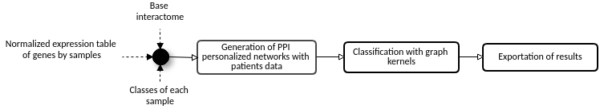

# Outcome Disease Prediction Pipeline

Pipeline that combines protein interactions data with normalized table of genes by samples of a gene expression experiment for some genetic disease in order to predict the outcome of this disease for the patients (each sample). Here, we present examples for two scenarios: Leukaemia and Ovarian cancer datasets.

## Summary

The data preparation pipeline contains tasks for two distinct scenarios: [leukaemia](https://www.ncbi.nlm.nih.gov/geo/query/acc.cgi?acc=GSE425) that contains microarray data for 119 patients and [ovarian](https://www.ncbi.nlm.nih.gov/geo/query/acc.cgi?acc=GSE140082) cancer that contains next generation sequencing data for 380 patients.

The outcome disease prediction pipeline starts generating personalized networks for each patient using the interactome file provided and generate the patient network checking if each PPI of the interactome has both proteins up regulated or down regulated according to the gene expression table provided. The first step generate a set of graphs for the patients that are evaluated with 4 distinct kernels for graph classification, which are: Linear kernel between edge histograms, Linear kernel between vertex histograms, Linear kernel between vertex-edge histograms and Linear kernel combination. These kernels functions calculate a similarity matrix for the graphs and then this matrix is used by the support vector machine classifier. Then the predictions are delivered to the last task that exports a report with the accuracy reached by each kernel.

The figure below illustrates all the tasks of this pipeline.

<div style="text-align: center">
	
</div>

## Requirements:
* Python packages needed:
	- statistics
	- os
	- urllib
	- networkx
	- matplotlib
	- json
	- sklearn
	- [graphkernels](https://github.com/eghisu/GraphKernels)
	- igraph
	- numpy

## Usage Instructions
### Preparation:
1. ````git clone https://github.com/YasCoMa/OutcomeDiseasePrediction.git````
2. ````cd OutcomeDiseasePrediction````

### Data preparation - File ````data_preparation_for_pipeline.py```` :
* GEO raw data umcompression
    - Umcompress data_preparation/ovarian/GSE140082.tar.xz
    
* Pipeline parameters:
	- __-rt__ or __--running_type__ <br>
		Use to prepare data for the desired scenario: <br>
		1 - Run with Leukaemia data <br>
		2 - Run with Ovarian cancer data

* Running modes examples:
	1. Run for Leukaemia data: <br>
	````python3 data_preparation_for_pipeline.py -rt 1 ````

	2. Run for Ovarian cancer data: <br>
	````python3 data_preparation_for_pipeline.py -rt 2 ````

		In this case, you must have [R](https://www.r-project.org/) installed and also the library [DESeq](https://bioconductor.org/packages/release/bioc/html/DESeq.html), because this scenario treats next generation sequencing data

### Outcome disease prediction execution - File ````pipeline_outcome_prediction.py````:

* Pipeline parameters:
	- __-fo__ or __--folder__ <br>
		Folder to store the files (use the folder where the other required file can be found)

	- __-if__ or __--interactome_file__ <br>
		File with the pairs (two columns with uniprot identifiers in tsv format)<br>
		
		Example of this file: test_pipeline_leukaemia/interactome.tsv

	- __-etf__ or __--expression_table_file__ <br>
		File with the expression values for the genes by sample/patient in tsv format<br>
		
		Example of this file: test_pipeline_leukaemia/expression_table_leukaemia.tsv

	- __-lf__ or __--label_file__ <br>
		File with the prognosis label for each sample<br>
		
		Example of this file: test_pipeline_leukaemia/patients_labels_leukaemia.tsv

* Running modes examples:
	1. Running outcome disease prediction for Leukaemia: <br>
		````python3 pipeline_outcome_prediction.py -fo test_pipeline_leukaemia/ -if interactome.tsv -etf expression_table_leukaemia.tsv -lf patients_labels_leukaemia.tsv````

	2. Running outcome disease prediction for Ovarian cancer: <br>
		````python3 pipeline_outcome_prediction.py -fo test_pipeline_ovarian/ -if interactome.tsv -etf expression_table_ovarian.tsv -lf patients_labels_ovarian.tsv````
		

## Reference

## Bug Report
Please, use the [Issue](https://github.com/YasCoMa/OutcomeDiseasePrediction/issues) tab to report any bug.
